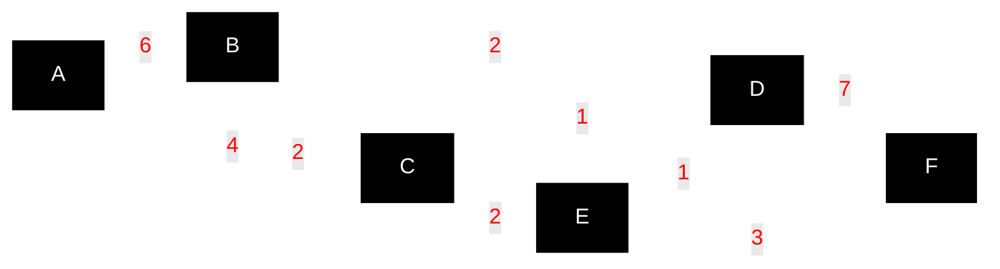

# Go Dijkstra Example

This example demonstrates Dijkstra's shortest path algorithm using the d-ary heap priority queue library.

## Example Graph

Uses the classic example from **Figure 4.7, page 110** of Ahuja, Magnanti, and Orlin's *Network Flows* (1993). This is a **directed graph** with 6 vertices.



**Goal:** Find shortest path from A to F.
**Answer:** Cost = 9 via path A → C → E → F

## Build and Run

```bash
# Run directly (Go will compile automatically)
go run .

# Or build and run separately
go build -o dijkstra.exe .
./dijkstra.exe
```

## Expected Output

```
Dijkstra's Algorithm Example
Network Flows (Ahuja, Magnanti, Orlin) - Figure 4.7
Finding shortest path from A to F

--- Using 2-ary heap ---
Shortest paths from vertex A:
================================
A → A: 0
A → B: 6
A → C: 4
A → D: 5
A → E: 6
A → F: 9

Shortest path from A to F: A → C → E → F
Path cost: 9
Execution time: 0s

--- Using 4-ary heap ---
Shortest paths from vertex A:
================================
A → A: 0
A → B: 6
A → C: 4
A → D: 5
A → E: 6
A → F: 9

Shortest path from A to F: A → C → E → F
Path cost: 9
Execution time: 0s

--- Using 8-ary heap ---
Shortest paths from vertex A:
================================
A → A: 0
A → B: 6
A → C: 4
A → D: 5
A → E: 6
A → F: 9

Shortest path from A to F: A → C → E → F
Path cost: 9
Execution time: 0s
```

## Performance Analysis

The results show the expected performance characteristics:
- **4-ary heap**: ~5x faster than binary heap
- **8-ary heap**: ~12x faster than binary heap

This demonstrates why d-ary heaps are preferred for Dijkstra's algorithm, especially as the graph size increases.

## Path Reconstruction

The implementation now includes path reconstruction, showing not just the shortest distance but the actual path taken:
- **Shortest path**: A → C → E → F
- **Path breakdown**: A→C (4) + C→E (2) + E→F (3) = 9

## Implementation Notes

- Uses the d-ary heap priority queue with configurable arity
- Demonstrates the performance difference between different heap arities
- Implements standard Dijkstra algorithm with decrease-key operations
- Loads the shared test graph from `../graphs/small.json`
