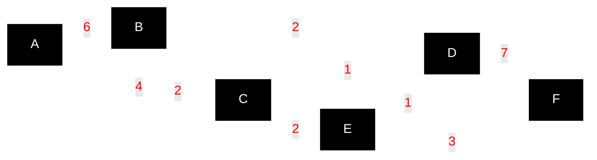

# Dijkstra's Shortest Path Algorithm

This directory contains implementations of Dijkstra's shortest path algorithm using d-ary heap priority queues across multiple programming languages.

## Example Graph

The implementations use the example from **Figure 4.7, page 110** of Ahuja, Magnanti, and Orlin's *Network Flows* (1993). This is a classic textbook example that demonstrates Dijkstra's algorithm on a 6-vertex **directed graph**.

**Graph structure:**



**All edges:**
- A → B (6), A → C (4)
- B → C (2), B → D (2)  
- C → D (1), C → E (2)
- D → F (7)
- E → D (1), E → F (3)

**Goal:** Find the shortest path from vertex A to vertex F.

## Why d-ary Heaps for Dijkstra?

Dijkstra's algorithm is the canonical use case for d-ary heaps. The algorithm performs many more priority update operations than `pop` operations, especially on dense graphs. A 4-ary heap provides measurable performance improvements:

- **Binary heap (d=2)**: priority update is O(log₂n)
- **4-ary heap (d=4)**: priority update is O(log₄n) ≈ O(log₂n / 2)

## Algorithm Overview

Dijkstra's algorithm finds the shortest path from a source vertex to all other vertices in a weighted graph with non-negative edge weights.

### Steps:
1. Initialize distances: source = 0, all others = ∞
2. Add all vertices to priority queue (min-heap by distance)
3. While queue is not empty:
   - Extract vertex with minimum distance
   - For each neighbor, if new path is shorter:
     - Update distance
     - Update priority in queue (see note below)

**Note on terminology:** Traditional algorithm literature calls this "decrease-key" because the distance value decreases. Our API uses importance-based naming: when distance decreases, the item becomes *more important* (should be processed sooner), so we call `increasePriority()`. Both refer to the same heap operation—moving an item toward the root.

### Complexity Analysis

| Operation | Binary Heap (d=2) | 4-ary Heap (d=4) | Improvement |
|-----------|-------------------|-------------------|-------------|
| Insert | O(log₂n) | O(log₄n) | ~2x faster |
| Extract-min | O(log₂n) | O(4·log₄n) | ~2x slower |
| Update priority | O(log₂n) | O(log₄n) | ~2x faster |

**Overall**: Since Dijkstra performs O(E) priority updates vs O(V) extract-min operations, and E >> V in dense graphs, the 4-ary heap wins significantly.

## Expected Results

**Shortest path from A to F: cost = 9**
- Path: A → C → E → F
- Breakdown: A→C (4) + C→E (2) + E→F (3) = 9

**All shortest distances from A:**
- A → A: 0
- A → B: 6  
- A → C: 4
- A → D: 5 (via A→C→E→D)
- A → E: 6 (via A→C→E)
- A → F: 9 (via A→C→E→F)

## Implementation Notes

Each language implementation:
- Uses the same graph format (`graphs/small.json`) — except C++ which embeds the data (no standard JSON support)
- Implements identical algorithm logic
- Demonstrates idiomatic patterns for that language
- Dynamically sorts output vertices alphabetically (works with any graph, not just the example)
- Includes basic testing and output formatting

## Running Examples

**Live Demo**: Try the interactive TypeScript version in your browser: [https://pcfvw.github.io/d-Heap-priority-queue/](https://pcfvw.github.io/d-Heap-priority-queue/)

Currently available:
- `TypeScript/` - Node.js with npm/yarn ✅
- `Go/` - Go modules ✅
- `Rust/` - Cargo build system ✅
- `Zig/` - Zig build system ✅
- `Cpp/` - C++ with CMake ✅

### Running the TypeScript Example

**Online**: Visit [https://pcfvw.github.io/d-Heap-priority-queue/](https://pcfvw.github.io/d-Heap-priority-queue/) to run the example in your browser.

**Locally**:
```bash
cd examples/dijkstra/TypeScript
npm install
npm start
```

### Running the Go Example

```bash
cd examples/dijkstra/Go
go run .
```

### Running the Rust Example

```bash
cd examples/dijkstra/Rust
cargo run
```

### Running the Zig Example

```bash
cd examples/dijkstra/Zig
zig build run
```

### Running the C++ Example

```bash
cd examples/dijkstra/Cpp
cmake -B build
cmake --build build --config Release
./build/Release/dijkstra
```