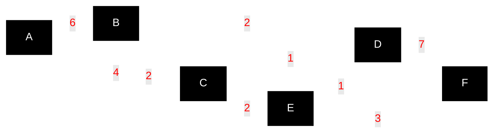

# Dijkstra's Shortest Path Algorithm

This directory contains implementations of Dijkstra's shortest path algorithm using d-ary heap priority queues across multiple programming languages.

## Example Graph

The implementations use the example from **Figure 4.7, page 110** of Ahuja, Magnanti, and Orlin's *Network Flows* (1993). This is a classic textbook example that demonstrates Dijkstra's algorithm on a 6-vertex **directed graph**.

**Graph structure:**


```mermaid
graph LR
    A -->|6| B
    A -->|4| C
    B -->|2| C
    B -->|2| D
    C -->|1| D
    C -->|2| E
    D -->|7| F
    E -->|1| D
    E -->|3| F
    
    style A fill:#000000,stroke:#ffffff,stroke-width:2px,color:#ffffff
    style B fill:#000000,stroke:#ffffff,stroke-width:2px,color:#ffffff
    style C fill:#000000,stroke:#ffffff,stroke-width:2px,color:#ffffff
    style D fill:#000000,stroke:#ffffff,stroke-width:2px,color:#ffffff
    style E fill:#000000,stroke:#ffffff,stroke-width:2px,color:#ffffff
    style F fill:#000000,stroke:#ffffff,stroke-width:2px,color:#ffffff
    
    linkStyle 0 stroke:#ffffff,stroke-width:2px,color:#ff0000
    linkStyle 1 stroke:#ffffff,stroke-width:2px,color:#ff0000
    linkStyle 2 stroke:#ffffff,stroke-width:2px,color:#ff0000
    linkStyle 3 stroke:#ffffff,stroke-width:2px,color:#ff0000
    linkStyle 4 stroke:#ffffff,stroke-width:2px,color:#ff0000
    linkStyle 5 stroke:#ffffff,stroke-width:2px,color:#ff0000
    linkStyle 6 stroke:#ffffff,stroke-width:2px,color:#ff0000
    linkStyle 7 stroke:#ffffff,stroke-width:2px,color:#ff0000
    linkStyle 8 stroke:#ffffff,stroke-width:2px,color:#ff0000
```

**All edges:**
- A → B (6), A → C (4)
- B → C (2), B → D (2)  
- C → D (1), C → E (2)
- D → F (7)
- E → D (1), E → F (3)

**Goal:** Find the shortest path from vertex A to vertex F.

## Why d-ary Heaps for Dijkstra?

Dijkstra's algorithm is the canonical use case for d-ary heaps. The algorithm performs many more priority update operations than `pop` operations, especially on dense graphs. A 4-ary heap provides measurable performance improvements:

- **Binary heap (d=2)**: priority update is O(log₂n)
- **4-ary heap (d=4)**: priority update is O(log₄n) ≈ O(log₂n / 2)

## Algorithm Overview

Dijkstra's algorithm finds the shortest path from a source vertex to all other vertices in a weighted graph with non-negative edge weights.

### Steps:
1. Initialize distances: source = 0, all others = ∞
2. Add all vertices to priority queue (min-heap by distance)
3. While queue is not empty:
   - Extract vertex with minimum distance
   - For each neighbor, if new path is shorter:
     - Update distance
     - Update priority in queue (see note below)

**Note on terminology:** Traditional algorithm literature calls this "decrease-key" because the distance value decreases. Our API uses importance-based naming: when distance decreases, the item becomes *more important* (should be processed sooner), so we call `increasePriority()`. Both refer to the same heap operation—moving an item toward the root.

### Complexity Analysis

| Operation | Binary Heap (d=2) | 4-ary Heap (d=4) | Improvement |
|-----------|-------------------|-------------------|-------------|
| Insert | O(log₂n) | O(log₄n) | ~2x faster |
| Extract-min | O(log₂n) | O(4·log₄n) | ~2x slower |
| Update priority | O(log₂n) | O(log₄n) | ~2x faster |

**Overall**: Since Dijkstra performs O(E) priority updates vs O(V) extract-min operations, and E >> V in dense graphs, the 4-ary heap wins significantly.

## Expected Results

**Shortest path from A to F: cost = 9**
- Path: A → C → E → F
- Breakdown: A→C (4) + C→E (2) + E→F (3) = 9

**All shortest distances from A:**
- A → A: 0
- A → B: 6  
- A → C: 4
- A → D: 5 (via A→C→E→D)
- A → E: 6 (via A→C→E)
- A → F: 9 (via A→C→E→F)

## Graph Corpus

Beyond the textbook `small.json`, seven benchmark graphs are reproducibly generated by [`benchmarks/scripts/graphgen/`](../../benchmarks/scripts/graphgen/) and conform to [`graphs/GRAMMAR.md`](graphs/GRAMMAR.md):

| Name | \|V\| | \|E\| | Kind |
|---|---|---|---|
| `small` | 6 | 9 | hand-curated (Network Flows Figure 4.7) |
| `medium_sparse` | 100 | 200 | Erdős–Rényi, \|E\|≈2\|V\| |
| `medium_dense` | 100 | 1000 | Erdős–Rényi, \|E\|≈\|V\|^1.5 |
| `medium_grid` | 100 | 360 | 10×10 lattice (4-connected, bidirected) |
| `large_sparse` | 1000 | 2000 | Erdős–Rényi, \|E\|≈2\|V\| |
| `large_dense` | 1000 | 31623 | Erdős–Rényi, \|E\|≈\|V\|^1.5 |
| `large_grid` | 1024 | 3968 | 32×32 lattice |
| `huge_dense` | 2500 | 125000 | Erdős–Rényi, \|E\|=\|V\|^1.5 (~6 MB JSON) |

Erdős–Rényi graphs are post-processed for connectivity (every vertex reachable from `v0`).

Each example accepts:
- `--graph=<name>` — select graph (default `small`)
- `--source=<vertex_id>` / `--target=<vertex_id>` — override endpoints
- `--quiet` — suppress per-vertex distance output (recommended for medium/large)

Defaults are `A`→`F` for `small` and `v0`→`v{N-1}` otherwise.

## Implementation Notes

Each language implementation:
- Uses the same JSON graph format — including C++, which parses the constrained subset via [`Cpp/graph_parser.h`](Cpp/graph_parser.h) (no third-party dependency)
- Implements identical algorithm logic
- Demonstrates idiomatic patterns for that language
- Dynamically sorts output vertices alphabetically (works with any graph, not just the example)
- Includes basic testing and output formatting

## Running Examples

**Live Demo**: Try the interactive TypeScript version in your browser: [https://pcfvw.github.io/d-Heap-priority-queue/](https://pcfvw.github.io/d-Heap-priority-queue/)

Currently available:
- `TypeScript/` - Node.js with npm/yarn ✅
- `Go/` - Go modules ✅
- `Rust/` - Cargo build system ✅
- `Zig/` - Zig build system ✅
- `Cpp/` - C++ with CMake ✅

### Running the TypeScript Example

**Online**: Visit [https://pcfvw.github.io/d-Heap-priority-queue/](https://pcfvw.github.io/d-Heap-priority-queue/) to run the example in your browser.

**Locally**:
```bash
cd examples/dijkstra/TypeScript
npm install
npm start                                  # default: --graph=small
npm start -- --graph=medium_sparse --quiet # benchmark-scale graph
```

### Running the Go Example

```bash
cd examples/dijkstra/Go
go run .                                   # default: --graph=small
go run . --graph=medium_dense --quiet
```

### Running the Rust Example

```bash
cd examples/dijkstra/Rust
cargo run --release                        # default: --graph=small
cargo run --release -- --graph=large_sparse --quiet
```

### Running the Zig Example

```bash
cd examples/dijkstra/Zig
zig build run                              # default: --graph=small
zig build run -- --graph=large_grid --quiet
```

### Running the C++ Example

```bash
cd examples/dijkstra/Cpp
cmake -B build
cmake --build build --config Release
./build/Release/dijkstra                   # default: --graph=small
./build/Release/dijkstra --graph=medium_grid --quiet
./build/Release/test_graph_parser examples/dijkstra/graphs   # run parser tests
```