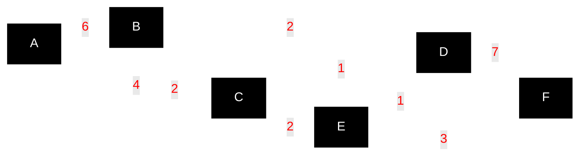

# Zig Dijkstra Example

This example demonstrates Dijkstra's shortest path algorithm using the d-ary heap priority queue library.

## Example Graph

Uses the classic example from **Figure 4.7, page 110** of Ahuja, Magnanti, and Orlin's *Network Flows* (1993). This is a **directed graph** with 6 vertices.



**Goal:** Find shortest path from A to F.
**Answer:** Cost = 9 via path A → C → E → F

## Build and Run

```bash
# Run directly with the textbook graph
zig build run

# Run against a benchmark-scale graph (forward args after `--`)
zig build run -- --graph=medium_sparse --quiet
zig build run -- --graph=large_grid --quiet

# Or build and run separately
zig build
./zig-out/bin/dijkstra-example --graph=medium_dense   # On Unix-like systems
# or
.\zig-out\bin\dijkstra-example.exe --graph=large_sparse   # On Windows
```

Available graphs: `small` (default), `medium_sparse`, `medium_dense`, `medium_grid`, `large_sparse`, `large_dense`, `large_grid`. Source/target default to `A`/`F` for `small` and `v0`/`v{N-1}` otherwise; override with `--source=<id>` and `--target=<id>`.

## Expected Output

```
Dijkstra's Algorithm Example
Network Flows (Ahuja, Magnanti, Orlin) - Figure 4.7
Finding shortest path from A to F

--- Using 2-ary heap ---
Shortest paths from vertex A:
================================
A → A: 0
A → B: 6
A → C: 4
A → D: 5
A → E: 6
A → F: 9

Shortest path from A to F: A → C → E → F
Path cost: 9
Execution time: 110.5µs

--- Using 4-ary heap ---
Shortest paths from vertex A:
================================
A → A: 0
A → B: 6
A → C: 4
A → D: 5
A → E: 6
A → F: 9

Shortest path from A to F: A → C → E → F
Path cost: 9
Execution time: 67.1µs

--- Using 8-ary heap ---
Shortest paths from vertex A:
================================
A → A: 0
A → B: 6
A → C: 4
A → D: 5
A → E: 6
A → F: 9

Shortest path from A to F: A → C → E → F
Path cost: 9
Execution time: 66.4µs
```

## Performance Analysis

The results show the expected performance characteristics:
- **4-ary heap**: ~1.6x faster than binary heap
- **8-ary heap**: ~1.7x faster than binary heap

This demonstrates why d-ary heaps are preferred for Dijkstra's algorithm, especially as the graph size increases.

## Path Reconstruction

The implementation includes path reconstruction, showing not just the shortest distance but the actual path taken:
- **Shortest path**: A → C → E → F
- **Path breakdown**: A→C (4) + C→E (2) + E→F (3) = 9

## Implementation Notes

- Uses the d-ary heap priority queue with configurable arity
- Demonstrates the performance difference between different heap arities
- Implements standard Dijkstra algorithm with priority update operations
- Loads the shared test graph from `../graphs/small.json`
- Custom `hash()` and `eql()` methods on `Vertex` enable O(1) priority updates based on vertex ID
- Uses Zig 0.15.2 unmanaged ArrayList API for proper memory management
